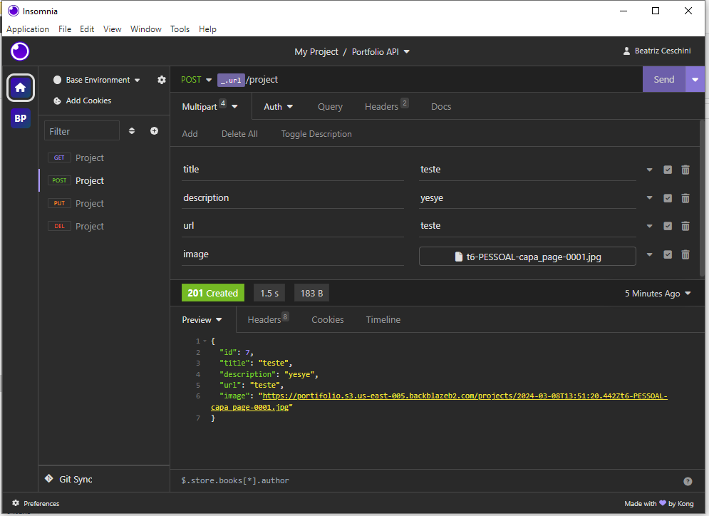

# Sobre o Projeto

Este projeto foi desenvolvido de forma recreativa para complementar a criação do meu portfólio, facilitando a edição e adição de novos projetos ao catálogo.

# API de Projetos

O projeto apresenta uma API dedicada ao gerenciamento de projetos e foi idealizada para ser utilizada no gerenciamento de portfólios. Com a implementação do CRUD, a API garante que podemos editar facilmente a lista de projetos, facilitando a publicação dos mesmos e atualizando rapidamente a página publicada no lado do cliente, sem a necessidade de edição de código e novos deploys.

### Banco de dados

Para o gerenciamento dos dados, foi utilizado o PostgreSQL e criado um banco de dados para armazenamento.

## Tecnologias

`Javascript` `Node.js` `PostgreSQL`

# Para ultilizar na sua máquina

### Instações necessárias:

- [Node.js](https://nodejs.org/en) em versão 18 ou superior;
- [PostgreSQL](https://www.postgresql.org/download/);
- [Beekeeper Studio](https://www.beekeeperstudio.io/);
- [Insomnia](https://insomnia.rest/download);

## Passo a passo :

1. Faça download do repositório no seu computador;
2. Copie o arquivo `dump.sql` e realize a criação do banco de dados com ultilização do `Beekeeper` e `PostgreSQL`;
3. Carregue o arquivo `Insomnia-PDV.json` no programa Insomnia e faça as adequações necessárias;
4. Usando o terminal no diretório do projeto instale as dependencias através do `npm install`;
5. Crie um arquivo `.env` de acordo com as informações presentes no arquivo `.env.exemplo` e preencha com as informações necessárias (Dados de conexão com o banco de dados, e Bucket da Backblaze);
6. Utilize o comando `npm run start` para rodar a API em um servidor local;

# Sobre mim:

[Beatriz Ceschini ](https://github.com/TrizCes/)

  - Link do meu [Portfólio](https://www.trizces.tech/)

###### tags: `back-end` `nodeJS` `PostgreSQL` `API REST` `portfolio` `javascript` `organização`
